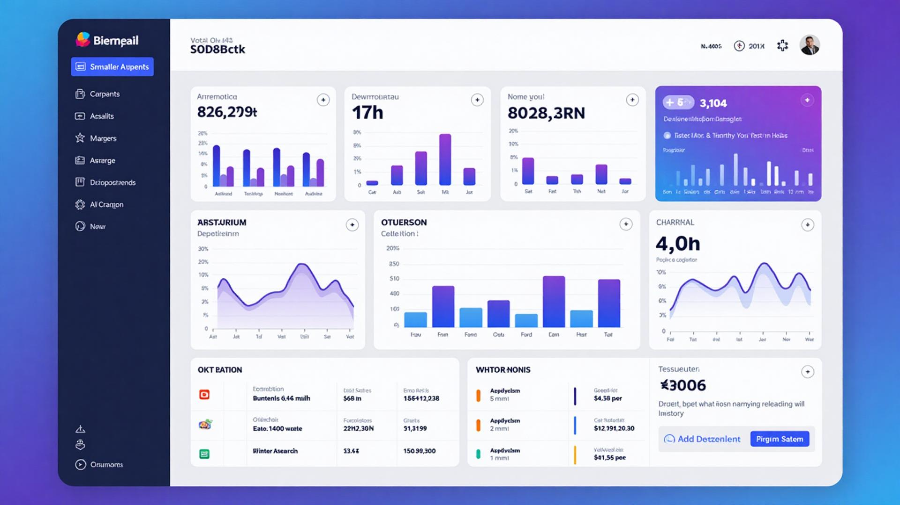
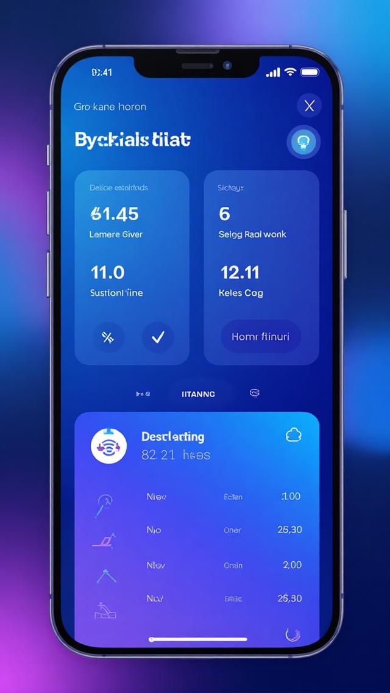
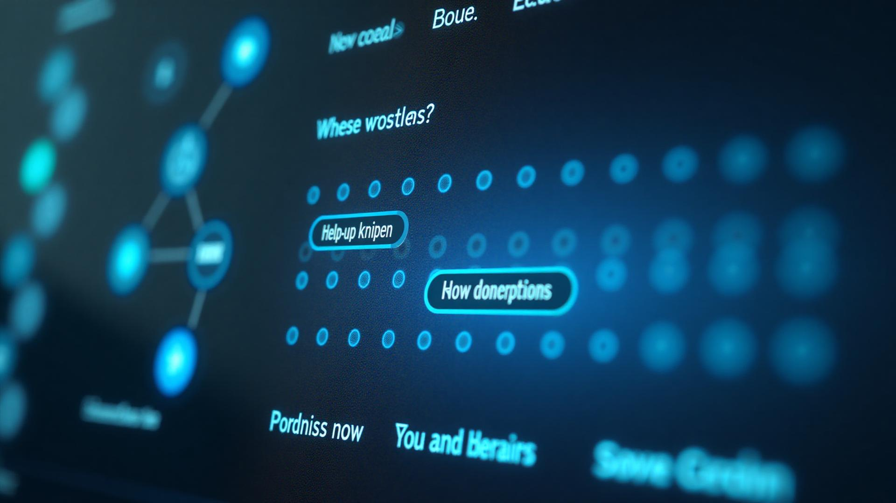

# Glam Admin Palette 🎨

A beautiful, modern admin dashboard built with React, TypeScript, and Tailwind CSS. Features a responsive design with glass morphism effects, smooth animations, and an intelligent help system.

## 📸 Screenshots

### Desktop Dashboard


### Mobile View


### Help System Demo


## 🌟 Features

### 🎨 Modern Design
- **Glass morphism UI** with beautiful backdrop blur effects
- **Gradient backgrounds** and premium shadows throughout
- **Smooth animations** with 500ms transitions and GPU acceleration
- **Beautiful card designs** with blended background patterns
- **Professional color scheme** using primary blue and accent purple

### 📱 Responsive Layout
- **Desktop**: Left sidebar navigation with full-featured layout
- **Mobile/Tablet**: Bottom navigation bar optimized for touch
- **Adaptive content area** that automatically adjusts to screen size
- **Touch-friendly buttons** with proper padding and hover states

### 🔍 Interactive Help System
- **Toggle help mode** with question mark icon in header
- **Blue help dots** with ripple effects on all interactive elements
- **Contextual tooltips** explaining each feature and function
- **Smart positioning** with proper z-index management

### ⚡ Performance Optimized
- **Hardware acceleration** for silky smooth animations
- **Efficient rendering** with proper CSS optimizations
- **Responsive breakpoints** for all device sizes
- **Custom scrollbar** styling for enhanced user experience

## Project info

**URL**: https://lovable.dev/projects/a4f2a669-11eb-4c5e-9144-dc56f13b0e54

## How can I edit this code?

There are several ways of editing your application.

**Use Lovable**

Simply visit the [Lovable Project](https://lovable.dev/projects/a4f2a669-11eb-4c5e-9144-dc56f13b0e54) and start prompting.

Changes made via Lovable will be committed automatically to this repo.

**Use your preferred IDE**

If you want to work locally using your own IDE, you can clone this repo and push changes. Pushed changes will also be reflected in Lovable.

The only requirement is having Node.js & npm installed - [install with nvm](https://github.com/nvm-sh/nvm#installing-and-updating)

Follow these steps:

## 🚀 Quick Start

Follow these steps to run the project locally:

```sh
# Step 1: Clone the repository using the project's Git URL.
git clone <YOUR_GIT_URL>

# Step 2: Navigate to the project directory.
cd <YOUR_PROJECT_NAME>

# Step 3: Install the necessary dependencies.
npm i

# Step 4: Start the development server with auto-reloading and instant preview.
npm run dev
```

## 🛠️ Development Options

**Use Lovable (Recommended)**

Simply visit the [Lovable Project](https://lovable.dev/projects/a4f2a669-11eb-4c5e-9144-dc56f13b0e54) and start prompting.

Changes made via Lovable will be committed automatically to this repo.

**Use your preferred IDE**

If you want to work locally using your own IDE, you can clone this repo and push changes. Pushed changes will also be reflected in Lovable.

The only requirement is having Node.js & npm installed - [install with nvm](https://github.com/nvm-sh/nvm#installing-and-updating)

**Edit a file directly in GitHub**

- Navigate to the desired file(s).
- Click the "Edit" button (pencil icon) at the top right of the file view.
- Make your changes and commit the changes.

**Use GitHub Codespaces**

- Navigate to the main page of your repository.
- Click on the "Code" button (green button) near the top right.
- Select the "Codespaces" tab.
- Click on "New codespace" to launch a new Codespace environment.
- Edit files directly within the Codespace and commit and push your changes once you're done.

## 🎯 Key Components

### Navigation System
- `AdminSidebar` - Responsive navigation (sidebar + bottom bar)
- `AdminHeader` - Top header with search, help toggle, and notifications
- Smart responsive behavior with proper spacing and touch optimization

### Card Components
- `StatsCard` - Beautiful statistics cards with themed gradients
- `GlossyCard` - Premium glass morphism cards with decorative patterns
- `GradientButton` - Custom styled buttons with smooth animations

### Help System
- Interactive help dots with contextual explanations
- Hover tooltips for all interactive elements  
- Toggle on/off functionality with smooth animations

## 📱 Responsive Breakpoints

- **Mobile**: < 1024px (bottom navigation bar)
- **Desktop**: ≥ 1024px (left sidebar navigation)

## What technologies are used for this project?

This project is built with modern web technologies:

- **Vite** - Fast build tool and development server
- **TypeScript** - Type-safe JavaScript development
- **React 18** - Modern React with hooks and concurrent features
- **Shadcn/ui** - Beautiful, accessible component library
- **Tailwind CSS** - Utility-first CSS framework
- **Lucide React** - Modern, customizable icon library

## 🎨 Design System

The project features a comprehensive design system with:
- **HSL color values** for consistent theming across light/dark modes
- **Semantic design tokens** for colors, gradients, and shadows
- **Custom animations** with proper easing curves and GPU acceleration
- **Glass morphism effects** and modern visual patterns throughout

## How can I deploy this project?

Simply open [Lovable](https://lovable.dev/projects/a4f2a669-11eb-4c5e-9144-dc56f13b0e54) and click on Share -> Publish.

## Can I connect a custom domain to my Lovable project?

Yes, you can!

To connect a domain, navigate to Project > Settings > Domains and click Connect Domain.

Read more here: [Setting up a custom domain](https://docs.lovable.dev/tips-tricks/custom-domain#step-by-step-guide)
